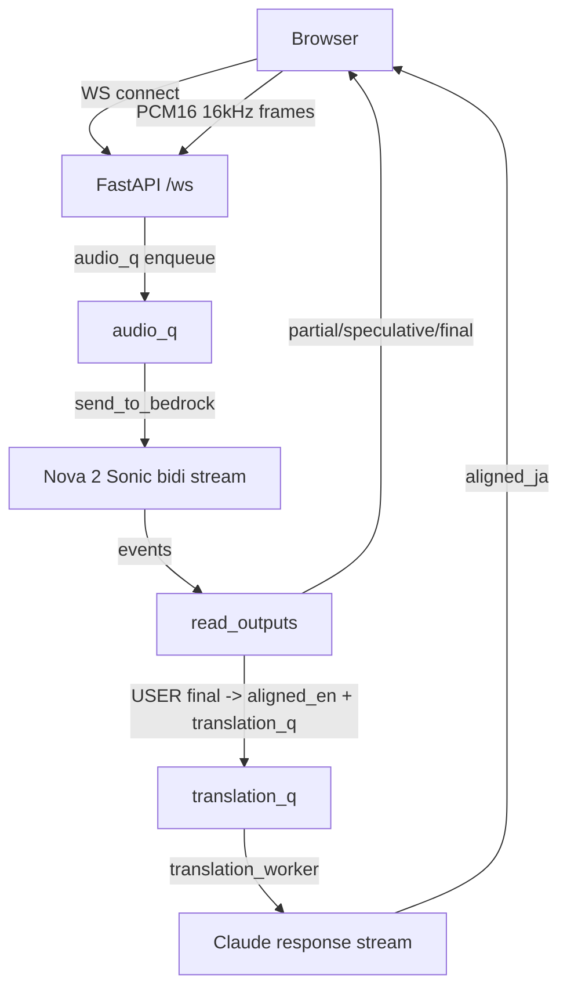

# 基本設計書（nova-transcribe）

**対象**: `main.py`（entrypoint） / `nova_transcribe/*`（FastAPI + WebSocket / Bedrock Nova 2 Sonic / Bedrock Claude（翻訳/Catch up））  
**作成日**: 2026-01-03  
**最終更新**: 2026-01-03  
**作成/更新根拠**: 2026-01-03 時点の `nova_transcribe/web.py` / `nova_transcribe/index.html` 実装（Mic/Tab Audio 入力、Aligned EN ↔ JA、Catch up を含む）を読んで整理（README とは独立）

---

## 1. 基本設計書の定義

本書における **基本設計書**（High-Level Design / Basic Design）は、要件と実装の間をつなぐ「システム全体の設計合意文書」として、以下を定義するものとします。

- **システムの目的・スコープ**（何をする/しない）
- **外部インターフェース**（HTTP / WebSocket の入出力、イベント形式）
- **主要コンポーネント構成**（ブラウザ、サーバ、外部サービス）
- **主要フロー**（起動〜終了、音声→文字起こし→翻訳の流れ、例外系）
- **依存関係**（利用ライブラリ、AWS サービス、ブラウザ API）
- **非機能設計**（低遅延、スループット、耐障害、運用）

※ 逆に、関数単位の詳細アルゴリズムや全例外網羅、実装コード断片の逐語的記載などは **詳細設計** の領域として本書では最小限に留めます。

---

## 2. システム概要

### 2.1 目的

- ブラウザの音声入力（**Mic / Tab Audio**）をリアルタイムに Bedrock に送信し、**英語文字起こし**を表示する
- 文字起こしの **USER ロールの final（確定）** を対象に、Bedrock の LLM で **英→日翻訳**を行い表示する
- 英語（発話）と日本語（翻訳）を **発話単位で対応づけ**し、UI で確認できるようにする
- 会議の「咄嗟に追いつけない」を補助するため、直近の会話を **Catch up（追いつき）** として要約表示できるようにする（参照IDで該当発話へジャンプ/ハイライト）

### 2.2 前提（重要）

- 音声入力は **16kHz / mono / 16bit PCM** を送る（ブラウザ側で変換）
- Bedrock の **Nova 2 Sonic 双方向ストリーミング**を利用する（8分寿命あり）
- 翻訳は Bedrock の **InvokeModelWithResponseStream** を利用する（スロットリングが起きうる）
- Anthropic 系モデルはアカウント/リージョンにより **inference profile 指定**や **use case details 提出**が必要な場合がある

---

## 3. 全体アーキテクチャ

### 3.1 コンポーネント構成

- **ブラウザ**
  - WebSocket 接続
  - Web Audio API で音声入力取得（`getUserMedia()` による Mic / `getDisplayMedia({audio:true, video:true})` による Tab Audio）
  - AudioWorklet（優先）/ ScriptProcessor（フォールバック）で 16kHz PCM 化し、100ms フレームで送信
  - 文字起こし表示、翻訳表示、英日ペア表示（レスポンシブ）
- **アプリサーバ（FastAPI）**
  - entrypoint は `main.py`（`uvicorn main:app`）
  - 実装本体は `nova_transcribe/web.py`
  - `/` で HTML/JS を返す（静的ファイルなし。`nova_transcribe/index.html` を `nova_transcribe/ui.py` で読み込み）
  - `/ws` で WebSocket を受け、バイナリ音声フレームと JSON 制御メッセージを扱う
  - Bedrock 双方向ストリームを開いて音声を送信し、イベントを受信してブラウザへ中継
  - 翻訳キューを別ワーカーで処理して、英日対応のイベントをブラウザへ送信
  - Catch up（追いつき）要求を受け、会話ログ（発話ID付き）を元に Claude で要約しブラウザへ返す
- **外部サービス（AWS）**
  - Bedrock Runtime: Nova 2 Sonic（双方向ストリーミング）
  - Bedrock Runtime: Claude（翻訳 / Catch up、レスポンスストリーミング）

### 3.2 動作フローチャート

#### 3.2.1 文字起こし + 翻訳（Aligned EN ↔ JA）



#### 3.2.2 Catch up（追いつき）

```mermaid
flowchart TD
  B[Browser] -->|catchup(seconds)| S[FastAPI /ws]
  S -->|utterance_log window| CUQ[catchup_q]
  CUQ -->|catchup_worker| C[Claude response stream]
  C -->|catchup_result (JSON)| B
```

---

## 4. 外部インターフェース設計

### 4.1 HTTP

- `GET /`
  - HTML/JS/CSS を返す（単一ページ UI）

### 4.2 WebSocket（`/ws`）

#### 4.2.1 クライアント → サーバ

- **バイナリ**: 100ms 分の PCM16LE フレーム（`ArrayBuffer`）
- **テキスト(JSON)**:
  - `{ "type": "pong" }`  
    - keepalive 応答（サーバ→ブラウザの `ping` へ応答、ブラウザからも定期送信）
  - `{ "type": "clear" }`  
    - UI のクリアに合わせ、サーバ側の翻訳待ちキューを破棄して整合を取る
  - `{ "type": "catchup", "seconds": 30 | 120 | 300 }`
    - 指定時間の会話を「追いつき用（catch up）」に要約する（手動ボタン）

#### 4.2.2 サーバ → クライアント

- 文字起こし:
  - `{ "type": "speculative" | "partial" | "final", "text": "..." }`
    - UI 側は `speculative`/`partial` を同等に扱い、表示中の partial を更新
- 状態:
  - `{ "type": "status", "status": "...", ... }`
    - AWS: `aws_connected` / `aws_error` / `transcribing`
    - Audio: `audio_receiving`
    - Translation: `translation_translating` / `translation_throttled` / `translation_disabled` / `translation_idle` / `translation_error`
    - Catch up: `catchup_generating` / `catchup_ready` / `catchup_throttled` / `catchup_error` / `catchup_idle`
  - `{ "type": "info", "text": "..." }`
  - `{ "type": "ping" }`（サーバ keepalive）
- 翻訳（対応づけ）:
  - `{ "type": "aligned_en", "id": "uN", "en": "..." }`（USER final を ID 付きで通知）
  - `{ "type": "aligned_ja", "id": "uN", "ja": "..." }`（翻訳結果を同 ID で通知）
  - `{ "type": "translation_error", "error": "..." }`
- Catch up（追いつき補助）:
  - `{ "type": "catchup_result", "window_seconds": N, "topic": "...", "important_points": [...], "decisions": [...], "next_topic": "..." }`
  - `{ "type": "catchup_error", "error": "..." }`

> 補足: 互換のため `type:"translation"` を受ける実装も UI に残っているが、現在の翻訳は `aligned_ja` を主として使う。

---

## 5. UI（画面）設計

### 5.1 画面要素

- 操作:
  - Start / Stop / Download TXT / Clear
  - Input（Mic / Tab Audio）
  - Catch up（30s / 2m / 5m）
- ステータス:
  - WebSocket / Audio / AWS / Translation / Catch up の 5インジケータ（操作バーはスクロールしても上部に追従）
- 表示エリア:
  - Transcript（英語）
  - Japanese Translation（ペアから再構築した日本語の一覧）
  - Aligned EN ↔ JA（USER final 単位の英日ペア）
  - Catch up（会話に追いつくための箇条書き。参照IDから該当行へジャンプ可能）

### 5.2 レスポンシブ方針（スマホ）

- 720px 以下では英日ペアを **2カラム→1カラム（縦積み）**に切り替える
- 縦積み時は `EN` / `JA` ラベルを表示して視認性を確保

---

## 6. 内部設計（サーバ側）

### 6.1 セッション管理（Nova 2 Sonic）

#### 6.1.1 `NovaSonicSession`

- `open(system_prompt)`
  - Bedrock の双方向ストリームを開始し、以下のイベントを送る
    - `sessionStart`（推論設定、turn detection）
    - `promptStart`（textOutput / audioOutput の設定）
    - `contentStart(TEXT/SYSTEM)` → `textInput` → `contentEnd`
    - `contentStart(AUDIO/USER)`（音声入力コンテナ）
- `send_audio(pcm16le_bytes)`
  - base64 化して `audioInput` イベントとして送る
- `recv_once()`
  - Bedrock から 1メッセージ受信して JSON decode する
- `close()`
  - `contentEnd` / `promptEnd` / `sessionEnd` を送って入力ストリームを閉じる

#### 6.1.2 8分寿命の回避

- `renew_loop` が `RENEW_SECONDS = 7m45s` ごとにセッションを張り替える
- 張り替えは `session_lock` で排他し、`read_outputs` タスクも作り直す

### 6.2 音声の受信・送信（キュー設計）

- `audio_q`（最大 20 フレーム）
  - WebSocket から届くフレームを投入
  - 満杯なら **古いフレームを破棄して新しいフレームを入れる**（リアルタイム性優先）
- `send_to_bedrock`
  - `audio_q` から取り出して `NovaSonicSession.send_audio()` へ送る
  - `session` 参照をロックフリーで取得し、レイテンシを抑える

### 6.3 出力処理（文字起こし）

- `read_outputs`
  - `contentStart` を受信したら `current_role` / `current_generation_stage` を更新
  - `textOutput` を受信したら:
    - `{ "interrupted": true }` のような **システムタグ**は除外
    - `USER` / `ASSISTANT` のみ UI に送る（`type` は stage を小文字化）
    - `stage == final` かつ `role == USER` の場合に翻訳キューへ投入し、同時に `aligned_en` を送る

### 6.4 翻訳処理（対応づけ + スロットリング対策）

- `translation_q`（最大 50）
  - 要素: `{ id: "uN", en: "..." }`
  - 満杯なら **古いリクエストを捨てて新しいものを優先**
- `translation_worker`
  - **debounce**（`TRANSLATION_DEBOUNCE_SECONDS`）で複数発話をまとめる
  - **最小間隔**（`TRANSLATION_MIN_INTERVAL_SECONDS`）で API コール頻度を抑える
  - **最大バッチ文字数**（`TRANSLATION_MAX_BATCH_CHARS`）で過大入力を防ぐ
  - 入力を `N<TAB>English` 形式にし、出力も同形式を要求（英日紐づけのため）
  - 受信ストリームのテキストを行単位でパースし、`aligned_ja(id, ja)` を送る
  - 例外:
    - `ValidationException` で inference profile 必須の文言があれば fallback に切替
    - `ResourceNotFoundException` で use case details 未提出が疑われる場合は翻訳を無効化し、キューを破棄
  - `ThrottlingException` は指数 backoff（最大 8s）し、待機中に溜まった分をバッチに合流

### 6.5 Catch up（追いつき）処理

- 目的: 会議中に一時的に集中が途切れても、直近の会話にすぐ追いつけるようにする
- 入力: UI ボタンから `catchup(seconds)`（例: 30/120/300）
- データ保持:
  - `aligned_en/ja` をサーバ側でも時刻付きで保持（リングバッファ: 件数/時間で上限）
  - 翻訳が到着したら同じ ID の `ja` を追記
- 実行:
  - 指定時間内の発話（主に USER final）を Claude に渡し、JSON 形式で
    - 今の話題 / 重要点 / 決定事項 / 次の話題
    を返す（日本語）
  - 重要点/決定事項には参照 ID（u12,u13…）を付け、UI がジャンプ/ハイライトに利用
- 制御:
  - 手動のみ（連打対策として `min_interval` を設ける）

---

## 7. 内部設計（ブラウザ側）

### 7.1 音声取り込みと送信

- 入力ソースは UI の `Input` で選択（`Mic` / `Tab Audio`）
  - `Mic`: `getUserMedia()` でマイク取得（echoCancellation/noiseSuppression/autoGainControl）
  - `Tab Audio`: `getDisplayMedia({ audio: true, video: true })` でタブ音声取得（Chrome/Edge 前提。共有ダイアログで **タブ**選択 + `Share tab audio` が必要）
    - 共有が停止されたら（track `ended`）セッションも自動停止
- AudioWorklet が使える場合:
  - ワーカ側でバッファリングし、メインへ Float32 を postMessage
  - 16kHz へダウンサンプリング → Int16 へ変換 → リングバッファへ
  - 100ms（1600 サンプル）単位で WebSocket バイナリ送信
- フォールバック:
  - ScriptProcessorNode で同様の処理

### 7.2 表示ロジック

- Transcript:
  - `final` は末尾に追記
  - `partial/speculative` は表示中の partial を更新
- Aligned EN ↔ JA:
  - `aligned_en(id,en)` で行を追加
  - `aligned_ja(id,ja)` で同じ行の日本語を更新
- Japanese Translation:
  - `alignedPairs` の `ja` を順に連結して再構築（表示用）

---

## 8. 依存関係

### 8.1 Python 依存（主要）

- `fastapi`
- `uvicorn`（起動方法は README 参照）
- `aws_sdk_bedrock_runtime`（smithy-python ベース）
- `smithy_core`, `smithy_http`, `smithy_aws_core`（署名/イベントストリーム/HTTP）

### 8.2 AWS 依存

- Amazon Bedrock Runtime
  - Nova 2 Sonic: `invoke_model_with_bidirectional_stream`
  - Claude: `invoke_model_with_response_stream`
- 認証:
  - 環境変数からの AWS 資格情報解決（`EnvironmentCredentialsResolver`）

### 8.3 ブラウザ API 依存

- WebSocket
- MediaDevices / Screen Capture API（`getUserMedia` / `getDisplayMedia`）
- Web Audio API（AudioContext / AudioWorklet / ScriptProcessorNode）
- Wake Lock API（対応ブラウザのみ）

---

## 9. 設定（環境変数）

### 9.1 一覧（必須/任意/既定値）

| カテゴリ | 変数 | 必須 | 既定値 | 備考 |
|---|---|---|---|---|
| AWS | `AWS_ACCESS_KEY_ID` | 必須 | なし | 環境変数からの認証情報解決（`EnvironmentCredentialsResolver`） |
| AWS | `AWS_SECRET_ACCESS_KEY` | 必須 | なし | 同上 |
| AWS | `AWS_SESSION_TOKEN` | 任意 | なし | 一時クレデンシャルのときのみ |
| AWS | `AWS_REGION` | 任意 | `ap-northeast-1` | Bedrock Runtime のリージョン |
| App | `LOG_LEVEL` | 任意 | `INFO` | ログレベル |
| 翻訳 | `TRANSLATION_MODEL_ID` | 任意 | `anthropic.claude-haiku-4-5-20251001-v1:0` | 環境により inference profile（例: `us....`）が必要 |
| 翻訳 | `TRANSLATION_MODEL_ID_FALLBACK` | 任意 | `us.anthropic.claude-haiku-4-5-20251001-v1:0` | on-demand 不可時のフォールバック |
| 翻訳 | `TRANSLATION_MAX_TOKENS` | 任意 | `400` | 翻訳の最大出力トークン |
| 翻訳 | `TRANSLATION_DEBOUNCE_SECONDS` | 任意 | `0.4` | まとめ待ち（リクエスト数削減） |
| 翻訳 | `TRANSLATION_MIN_INTERVAL_SECONDS` | 任意 | `0.6` | 最小リクエスト間隔 |
| 翻訳 | `TRANSLATION_MAX_BATCH_CHARS` | 任意 | `1200` | 最大入力文字数（概算） |
| Catch up | `CATCHUP_MODEL_ID` | 任意 | `us.anthropic.claude-haiku-4-5-20251001-v1:0` | Catch up のモデルID |
| Catch up | `CATCHUP_MODEL_ID_FALLBACK` | 任意 | `us.anthropic.claude-haiku-4-5-20251001-v1:0` | on-demand 不可時のフォールバック |
| Catch up | `CATCHUP_MAX_TOKENS` | 任意 | `350` | Catch up の最大出力トークン |
| Catch up | `CATCHUP_MIN_INTERVAL_SECONDS` | 任意 | `15` | 連打抑制 |
| Catch up | `CATCHUP_LOG_MAX_ITEMS` | 任意 | `200` | 会話ログ保持の最大発話数 |
| Catch up | `CATCHUP_LOG_MAX_SECONDS` | 任意 | `1800` | 会話ログ保持の最大秒数（30分） |
| Catch up | `CATCHUP_MAX_INPUT_CHARS` | 任意 | `6000` | 最大入力文字数（概算） |

### 9.2 備考

- 翻訳 / Catch up の実行には、Bedrock の Model access と IAM 権限（`InvokeModelWithResponseStream` 等）が必要。
- 既定値は `nova_transcribe/settings.py` の `os.getenv(..., "default")` に基づく。

---

## 10. 例外系・運用上の注意

- 翻訳のスロットリングは現実的に発生し得るため、UI の「遅延」や「一部未翻訳」は仕様として許容する
- Bedrock のストリーム寿命（8分）を超えるため、セッション更新を前提とする
- ログに文字起こしテキストの先頭が出るため、機微情報を扱う場合はログ方針の見直しが必要
- ブラウザ切断/無音が続くと Bedrock 側で `Timed out waiting for input events` が出ることがあるが、入力停止に伴う正常系として扱う

---

## 11. 既知の制約 / 今後の拡張案

- 翻訳の英日対応は、モデルが指定フォーマット（`N<TAB>...`）を守ることを前提とした **ベストエフォート**。逸脱時は該当行が欠落する可能性がある。
- `ASSISTANT` ロールは翻訳対象外（音声発話ではないため）。必要なら別設計で扱う。
- 英日行のスクロール「完全同期」は、文字数差が大きい場合に破綻しやすい。現状は「同一行でハイライト/近い位置」を優先。
- `Tab Audio` は Chrome/Edge 前提で、共有ダイアログで **タブ**を選び `Share tab audio` を有効化しないと音声トラックが取れない場合がある（画面/ウィンドウ共有は無音になり得る）。
